# Sber ID SDK

IOS SDK помогает реализовать получение кода авторизации (Auth Code) Сбер ID минимальными усилиями со стороны разработчика и в соответствии с утвержденными гайдами по отображению кнопки. Чтобы добавить поддержку Сбер ID в свое приложение, следуйте инструкциям ниже. 

Для выполнения успешных запросов вам необходимо зарегистрировать ваше приложение в банке и подписать договор. Заявку можно оставить по [ссылке](https://developers.sber.ru/portal/tools/sber-id)

#### Авторизация:

[- Подключение SDK к вашему проекту](#Подключение)

[- Добавление кнопки Sber ID](#Добавление)

[- Настройка SDK](#Настройка)

[- Запуск процесса авторизации по Сбер ID](#Запуск)

[- Обработка ответа после авторизации](#Обработка)

[- Ошибки](#Ошибки)

#### Дополнительные способы авторизации:

[- Поддержка бесшовной авторизации](#ПоддержкаБесшовки)

[- Авторизация через единый web-портал авторизации по Сбер ID](#web-портал)

#### Внешний вид кнопки:

[- Кастомизация кнопки](#Кастомизация)

[- Персонализация](#Персонализация)

## Подключение SDK к проекту <a name="Подключение"></a> 
 
- Перетащите ```SberbankSDK.xcframework``` и ```MPAnalytics.xcframework```* в *Frameworks, Libraries, and Embedded Content*, а также выставите *Embed & Sign* и *Do Not Embed* соответственно.

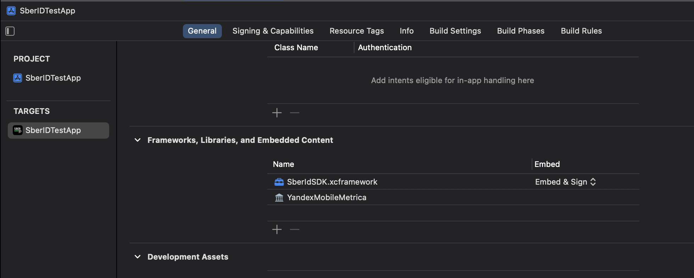

###### *Начиная с версии 1.3.0 SDK автоматически формирует и отправляет на сервер Сбербанка события, связанные с авторизацией по Сбер ID (показ и клик по кнопке, результат авторизации). При установке ширины кнопки меньше минимально допустимой, дополнительно к событию показа будет отправлено событие установки некорректной ширины.

- Отдельно добавьте ```MPAnalyticsDataModel.xcdatamodeld```, этот файл предоставляется в исходном виде и собирается вместе с приложением. Важно убрать галочку с *Copy items if needed*.

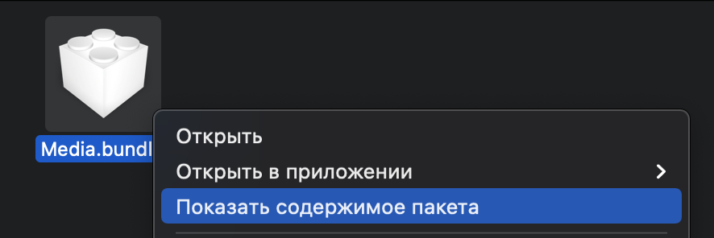 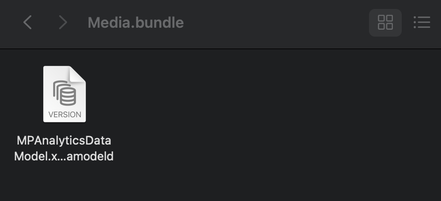
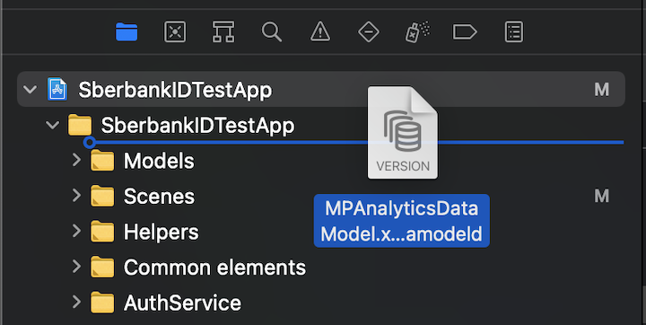 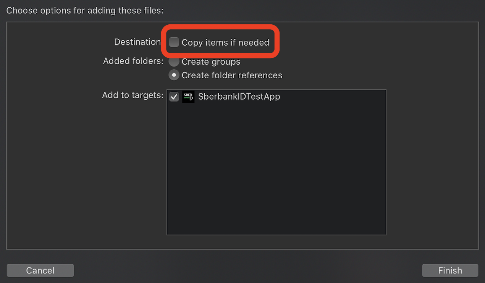

- Во вкладке *Build Phases*, в параметрах *Embed Frameworks* проверьте, что добавлен только ```SberbankSDK.xcframework```

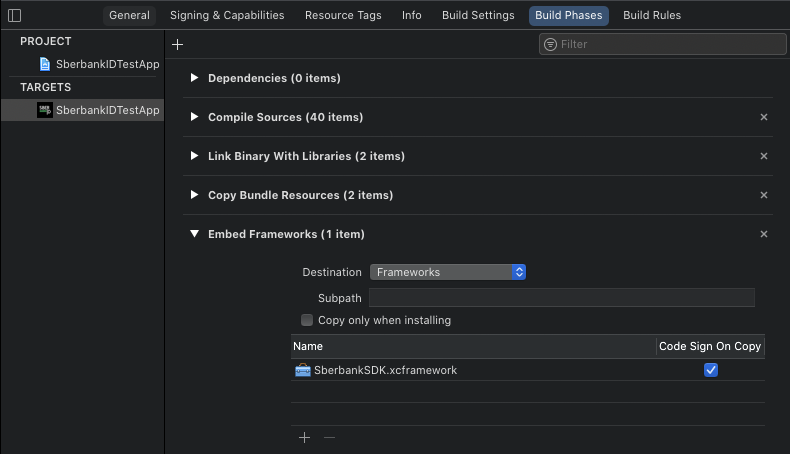

## Добавление кнопки Sber ID <a name="Добавление"></a> 

- Импортируйте модуль SberbankSDK.

###### Swift
```swift
import SberbankSDK
```
###### Objective C
```Objective-C
@import SberbankSDK;
```

- Создайте кнопку и добавьте её на view.

###### Swift
```swift
// Инициализаторы для создания кнопки:

/// Инициализатор создаст кнопку по стилистическому гайду Сбербанка с заданными размерами и выбранным заголовком
/// - Parameters:
///   - type: стиль кнопки
///   - textType: вариант текста
///   - clientId: идентификатор клиента
///   - desiredSize: желаемые высота и ширина
///   - observer: наблюдатель состояния кнопки
init(type: LoginButtonStyle,
     textType: LoginButtonTextType,
     clientId: String,
     desiredSize: CGSize,
     observer: LoginButtonObserverProtocol? = nil) {}
     
/// Инициализатор создаст кнопку только по выбранному стилю
/// - Parameters:
///   - type: стиль кнопки
///   - clientId: идентификатор клиента
///   - observer: наблюдатель состояния кнопки
init(type: LoginButtonStyle,
     clientId: String,
     observer: LoginButtonObserverProtocol? = nil) {}
     
// Пример:
let loginButton = SBKLoginButton(type: .white,
                                 clientId: "clientId")
loginButton.addTarget(self, action: #selector(loginButtonDidTap(_:)), for: .touchUpInside)
view.addSubview(loginButton)
```

###### Objective C
```Objective-C
// Инициализаторы для создания кнопки:

/// Инициализатор создаст кнопку по стилистическому гайду Сбербанка с заданными размерами и выбранным заголовком
/// params:
///   type: стиль кнопки
///   textType: вариант текста
///   clientId: идентификатор клиента
///   desiredSize: желаемые высота и ширина
///   observer: наблюдатель состояния кнопки
- (nonnull instancetype)initWithType:(enum LoginButtonStyle) 
                            textType:(enum LoginButtonTextType)
                            clientId:(NSString * _Nonnull)
                         desiredSize:(CGSize)
                            observer:(id<LoginButtonObserverProtocol> _Nullable) {}

/// Инициализатор создаст кнопку только по выбранному стилю
///   type: стиль кнопки
///   clientId: идентификатор клиента
///   observer: наблюдатель состояния кнопки
- (nonnull instancetype)initWithType:(enum LoginButtonStyle)
                            clientId:(NSString * _Nonnull)
                            observer:(id<LoginButtonObserverProtocol> _Nullable) {}

// Пример:
SBKLoginButton *loginButton = [[SBKLoginButton alloc] initWithType:LoginButtonStyleGreen clientId:"clientId" observer:nil];
[loginButton addTarget:self action:@selector(loginButtonDidTap:) forControlEvents:UIControlEventTouchUpInside];
[self.view addSubview:loginButton];
```

## Настройка SDK <a name="Настройка"></a> 

#### Проверка на допустимость авторизации по Сбер ID
Начиная с версии 2.0.0 в SDK реализована фоновая проверка на допустимость выполнения операции авторизации по Сбер ID. Она происходит путем запроса, для которого необходимо установить новые параметры в *Info.plist*.

- Если у вас уже выключен функционал дополнительных проверок по установке сетевого соединения с внешними ресурсами, в *Info.plist -> NSAppTransportSecurity -> NSAllowsArbitraryLoads* установлено значение ```true```, пропустите следующий шаг.

- Разрешите подключение приложения только к домену *id.sber.ru*. Добавьте в *Info.plist* следующие параметры:

```xml
<key>NSAppTransportSecurity</key>
    <dict>
        <key>NSExceptionDomains</key>
        <dict>
            <key>id.sber.ru</key>
            <dict>
                <key>NSExceptionAllowsInsecureHTTPLoads</key>
                <true/>
            </dict>
        </dict>
    </dict>
```

- Передайте параметр ```clientId``` при инициализации кнопки, равный значению ```clientId``` объекта ```SBKAuthRequest``` (см. [ниже](#ПараметрыЗапроса)).

❗️Важно: во избежание ситуации, когда скрытие кнопки Сбер ID повлияет на расположение элементов вашего экрана, предусмотрен специальный механизм получения информации о факте скрытия кнопки:

- В инициализатор ```SBKLoginButton``` нужно передать объект ```observer```, который реализует протокол ```LoginButtonObserverProtocol``` с методом ```loginButtonWasHidden```

###### Swift

```swift
class LoginButtonObserver: LoginButtonObserverProtocol {

	func loginButtonWasHidden() {
		//do something 
	}
}

let sberIdButton = SBKLoginButton(type: .white, 
				  textType: .short, 
				  clientId: "clientId", 
				  desiredSize: CGSize(), 
				  observer: LoginButtonObserver())
```

###### Objective C

```objc
@interface LoginButtonObserver: NSObject<LoginButtonObserverProtocol>
@end

@implementation LoginButtonObserver
- (void) loginButtonWasHidden
{
	// do something
}
@end

SBKLoginButton *loginButton = [[SBKLoginButton alloc] initWithType:LoginButtonStyleGreen 
							  clientId:@"clientId" 
							  observer:[LoginButtonObserver new]];
```
#### Проверка на возможность запуска приложения Сбербанк Онлайн

- Для того чтобы ваше приложение могло проверить возможность запуска приложения Сбербанк Онлайн в *Info.plist* необходимо добавить следующий параметр:

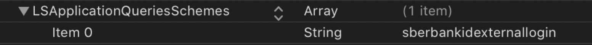

```xml
<key>LSApplicationQueriesSchemes</key>
<array>
    <string>sberbankidexternallogin</string>
</array>
```

## Запуск процесса авторизации по Сбер ID <a name="Запуск"></a> 

Для успешного запроса авторизации создайте и заполните объект ```SBKAuthRequest``` параметрами. Их описание можно найти в [1.1.2.1. Параметры запроса](https://api.developer.sber.ru/product/SberbankID/doc/v1/reqmobile). <a name="ПараметрыЗапроса"></a> 

Метод ```auth``` создадаст уникальную ссылку и для авторизации откроет мобильное приложение Сбербанк Онлайн (при наличии) либо веб окно. Для авторизации через метод ```soleLoginWebPageAuth``` перейдите в раздел [Авторизация через единый web-портал авторизации по Сбер ID](#web-портал)

###### Swift
```swift
// Параметры для поддержки PKCE
let verifier = SBKUtils.createVerifier()
let challenge = SBKUtils.createChallenge(verifier)
 
let request = SBKAuthRequest()
request.clientId = "your client id"
request.nonce = "your nonce"
request.scope = "your scope" //Перечисление scope через пробел
request.state = "your state"
request.redirectUri = "myapp://sberidauth"
request.codeChallenge = challenge //Необязательный параметр
request.codeChallengeMethod = SBKAuthRequest.challengeMethod //Необязательный параметр
 
// Запуск авторизации
let loginViewController = UIViewController()
SBKAuthManager.auth(withSberId: request, loginViewController) // Авторизоваться с помощью Сбербанк Онлайн, 
                                                              // если Сбербанк онлайн не установлен открывается
                                                              // веб окно авторизации.
```

###### Objective C
```Objective-C
// Параметры для поддержки PKCE
NSString *verifier = [SBKUtils createVerifier];
NSString *challenge = [SBKUtils createChallenge:verifier];
 
SBKAuthRequest *request = [SBKAuthRequest new];
request.clientId = @"your cliend id";
request.nonce = @"your nonce";
request.scope = @"your scope"; //Перечисление scope через пробел
request.state = @"your state";
request.redirectUri = @"myapp://sberidauth";
request.codeChallenge = challenge; //Необязательный параметр
request.codeChallengeMethod = SBKAuthRequest.challengeMethod; //Необязательный параметр
 
// Запуск авторизации
UIViewController *loginViewController = [UIViewController new];
[SBKAuthManager authWithSberId:request viewController:loginViewController]; // Авторизоваться с помощью Сбербанк Онлайн, 
                                                                            // если Сбербанк онлайн не установлен открывается
                                                                            // веб окно авторизации.
```
*в версиях до 1.3.1 открывается внешний браузер Safari - на данный момент это запрещено Apple.

*в версиях до 2.0.0, если вы использовали устаревшие методы запуска авторизации без ```viewController```, нужно установить свойство ```SBKAuthManager.navigationController```, чтобы открылся ```SafariViewController```, когда приложение Сбербанк Онлайн не может быть запущено (```UIApplication.shared.canOpenURL``` для Сбербанк Онлайн возвращает ```false```).

## Обработка ответа после авторизации <a name="Обработка"></a> 

После авторизации Сбербанк Онлайн перенаправит вас обратно в ваше приложение по адресу, указанному в параметре ```redirectUri``` объекта ```SBKAuthRequest```. Для того чтобы при переходе открылось ваше приложение, необходимо зарегистрировать deeplink(адрес) вашего приложения.

Откройте параметры проекта и перейдите во вкладку *Info*. В нижней части добавьте свой *URL Type*.

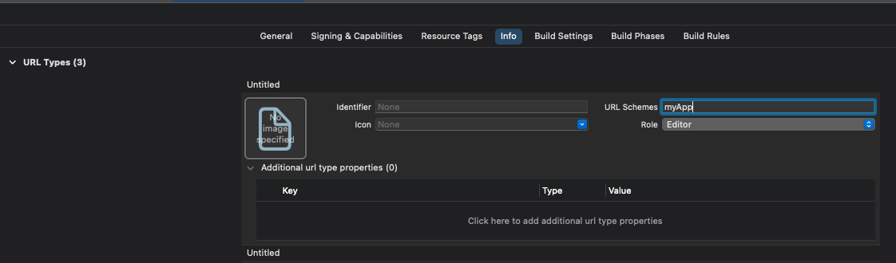


Далее в файле *AppDelegate* прописываем свою логику (см. пример ниже), метод ```application``` вызывается при открытии вашего приложения по deeplink(ссылке). ```SBKAuthManager.getResponseFrom(_ url: URL, completion: (SBKAuthResponse) -> Void)``` вернет вам объект ```SBKAuthResponse``` с полученными параметрами. 

###### Swift

```swift
func application(_ app: UIApplication, 
		 open url: URL, 
		 options: [UIApplication.OpenURLOptionsKey : Any] = [:]) -> Bool {     
    if url.scheme == "myapp" && url.host == "sberidauth" {
        SBKAuthManager.getResponseFrom(url) { response in
	    //do something         
        }
    }
    return true
}
```

###### Objective C

```objc
- (BOOL)application:(UIApplication *)app 
	    openURL:(NSURL *)url 
	    options:(NSDictionary<UIApplicationOpenURLOptionsKey,id> *)options
{
    if ([url.scheme isEqualToString:@"myapp"] && [url.host isEqualToString:@"sberidauth"])
    {
        [SBKAuthManager getResponseFrom:url completion:^(SBKAuthResponse *response) {
	    //do something
        }];
    }
    return YES;
}
```

Модель ответа:

###### Swift

```swift
class SBKAuthResponse : NSObject {

    /// Значение, сгенерированное внешней АС для предотвращения атак повторения
    var nonce: String { get }

    /// Значение для предотвращения подделки межсайтовых запросов, случайно сгенерированное
    var state: String? { get }

    /// Код авторизации клиента
    var authCode: String? { get }

    /// Текст ошибки
    var error: String? { get }

    /// Статус операции
    var isSuccess: Bool { get }
}
```
###### Objective C

```objc
@interface SBKAuthResponse : NSObject

/// Значение, сгенерированное внешней АС для предотвращения атак повторения
@property (nonatomic, readonly, copy) NSString * _Nonnull nonce;

/// Значение для предотвращения подделки межсайтовых запросов, случайно сгенерированное
@property (nonatomic, readonly, copy) NSString * _Nullable state;

/// Код авторизации клиента
@property (nonatomic, readonly, copy) NSString * _Nullable authCode;

/// Текст ошибки
@property (nonatomic, readonly, copy) NSString * _Nullable error;

/// Статус операции
@property (nonatomic, readonly) BOOL isSuccess;

- (instancetype)init NS_UNAVAILABLE;
+ (instancetype)new NS_UNAVAILABLE;

@end
```

## Ошибки <a name="Ошибки"></a> 

Если state сгенерированный вами и state возвращенный при авторизации по Сбер ID не совпадет, результат будет ошибочным, в SberIDResultModel.errorDescription вернется фраза "invalid_state". При других ошибках, таких как падение приложения Сбербанк Онлайн, прерывание сценария и др. будет ошибка "internal_error"

Пример ответа с ошибкой:

```
appScheme://redirect?status=fail&error=invalid_request
```

|№|типы возвращаемых ошибок|описание ошибки|
|:-------:|:-------:|:-------:|
|1|invalid_request|В запросе отсутствуют обязательные атрибуты.|
|2|unauthorized_client|АС-источник запроса не зарегистрирована в банке.|
|3|unauthorized_client|АС-источник запроса заблокирована в банке.|
|4|unauthorized_client|Значение атрибута client_id не соответствует формату.|
|5|unsupported_response_type|Значение атрибута response_type не равно «code».|
|6|invalid_scope|Запрошенный scope содержит значения, недоступные для АС-источника запроса.|
|7|invalid_request|Значение code_challenge_method не соответствуют допустимым значениям.|

## Поддержка бесшовной авторизации <a name="ПоддержкаБесшовки"></a>

Начиная с версии SDK 1.4.0 реализована поддержка бесшовной авторизации по Сбер ID. Бесшовная авторизация возможна при переходе из приложений СберБанка в ваше приложение и позволяет запустить авторизацию без показа кнопки и без нажатия на нее пользователем.

В диплинке, который придет в ваше приложение, будет дополнительный параметр - базовый урл. Чтобы получить значение этого параметра, необходимо воспользоваться методом ```getSSOUrlStringFrom(_ url: URL?)``` класса ```SBKUtils```, передав в него пришедший диплинк. Полученное значение необходимо передать в свойство ```ssoBaseUrl``` при построении объекта ```SBKAuthRequest```.


###### Для стандартной (не бесшовной) авторизации по Сбер ID с кнопкой, выполнять указанные в этом пункте действия не нужно.

###### Swift

```swift
/// Получение параметра ssoBaseUrl
let ssoBaseUrl = SBKUtils.getSSOUrlStringFrom(receivedUrl)

/// Присваивание параметра ssoBaseUrl свойству объекта SBKAuthRequest
let request = SBKAuthRequest(clientId: "client-ID",
                             scope: "scope",
                             state: "state",
                             nonce: "nonce",
			     ssoBaseUrl: ssoBaseUrl,
			     redirectUri: "https://testRedirect.url",
			     codeChallenge: "challenge",
			     codeChallengeMethod: SBKAuthRequest.challengeMethod)

/// ИЛИ:
let request = SBKAuthRequest()
/// заполнение запроса параметрами
request.ssoBaseUrl = ssoBaseUrl

/// Запуск авторизации
SBKAuthManager.auth(withSberId: request)
```


###### Objective C

```objc
/// Получение параметра ssoBaseUrl
NSString *ssoBaseUrl = [SBKUtils getSSOUrlStringFrom:receivedUrl];

/// Присваивание параметра ssoBaseUrl свойству объекта SBKAuthRequest
SBKAuthRequest *request = [[SBKAuthRequest alloc] initWithClientId:@"client-ID" 
							     scope:@"scope"
							     state:@"state"
							     nonce:@"nonce"
							ssoBaseUrl:ssoBaseUrl
						       redirectUri:@"https://testRedirect.url"
						     codeChallenge:@"challenge"
					       codeChallengeMethod: SBKAuthRequest.challengeMethod];
					       
/// ИЛИ:
SBKAuthRequest *request = [SBKAuthRequest new];
/// заполнение запроса параметрами
request.ssoBaseUrl = ssoBaseUrl

/// Запуск авторизации
[SBKAuthManager authWithSberId:request];
```

Все остальные действия по подготовке диплинка и старте авторизации аналогичны описанным в разделе [Запуск процесса авторизации по Сбер ID](#Запуск).

## Авторизация через единый web-портал авторизации по Сбер ID (OIDC) <a name="web-портал"></a>

В версии SDK 1.4.0 был добавлен новый метод для авторизации пользователя по Сбер ID. Он использует единое веб окно авторизации, которое открывается в вашем приложении через ```SafariViewController```. Кэширование веб окна ускоряет процесс авторизации при последующих запросах.

**Для этого:**
- Необходимо направить запрос нам на [почту](support@ecom.sberbank.ru) для добавления ваших диплинков в список доверенных. В запросе указывается ```client_id``` и список диплинков, по которым будет производиться возврат в ваше мобильное приложение.
- Создайте запрос ```SBKAuthRequest```, как при [обычном входе](#Запуск).
- Запустите OIDC авторизацию через метод ```soleLoginWebPageAuth``` с дополнительным параметром ```svcRedirectUrlString```. Если запуск сценария невозможен, вернется false.

###### Swift
```swift
let loginViewController = UIViewController()
SBKAuthManager.soleLoginWebPageAuth(sberIdRequest: request,           
                                    svcRedirectUrlString: "Ваш диплинк",
                                    viewController: loginViewController) // Авторизация с помощью веб окна.
```

###### Objective C

```Objective-C
// Запуск авторизации
UIViewController *loginViewController = [UIViewController new];
[SBKAuthManager soleLoginWebPageAuthWithSberIdRequest:request 
                                 svcRedirectUrlString:@"Ваш диплинк" 
                                       viewController:yourLoginViewController]; // Авторизация с помощью веб окна.
```


Откроется единое веб окно авторизации в SafariViewController с различными способами идентификации входа по Сбер ID:

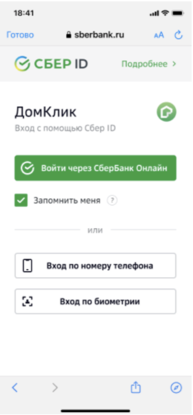

Новый параметр ```svcRedirectUrlString``` используется для передачи «активности» в ваше приложение из ```SafariViewControllera```. После прохождения авторизации на портале и возврата в ваше приложение(по диплинку из ```svcRedirectUrlString```) процесс авторизации продолжит работу по стандартному сценарию OIDC. В ваше приложение вернется ```AuthCode``` и другие параметры через диплинк, переданный в ```SBKAuthRequest().redirectUri```. Вам необходимо закрыть ```SafariViewController``` самостоятельно. Дальнейшие шаги процесса авторизации описаны в разделе [Запуск процесса авторизации по Сбер ID](#Запуск)


## Кастомизация кнопки <a name="Кастомизация"></a> 

Возможные вариации кнопки, а также рекомендуемые размеры можно найти в [гайдбуке по кнопке авторизации](https://www.figma.com/file/S7nPyGmpZFuk0oTOOAYQrQ/%5BBrand%5D-%D0%93%D0%B0%D0%B8%CC%86%D0%B4%D0%B1%D1%83%D0%BA-%D0%BF%D0%BE-%D0%BA%D0%BD%D0%BE%D0%BF%D0%BA%D0%B5-%D0%B0%D0%B2%D1%82%D0%BE%D1%80%D0%B8%D0%B7%D0%B0%D1%86%D0%B8%D0%B8?node-id=0%3A1)

### Стили

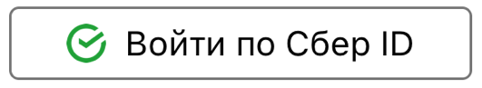

Стиль устанавливается при инициализации кнопки Sber ID:

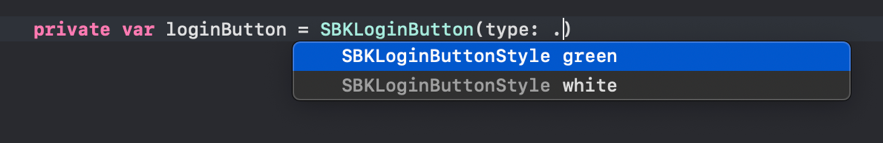

### Варианты текста (по умолчанию "Войти по Сбер ID")

```swift
LoginButtonTextType.short    // "Сбер ID"
LoginButtonTextType.general  // "Войти по Сбер ID"
LoginButtonTextType.filling  // "Заполнить со Сбер ID"
LoginButtonTextType.pursue   // "Продолжить со Сбер ID"
```

Установить вариант текста можно при инициализации кнопки Sber ID. Установка собственного текста, шрифта, цвета текста не поддерживается.

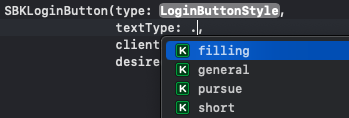

Тексты поддерживают английскую локализацию на устройстве. При выборе локализации, отличной от русской и английской, тексты будут на русском.

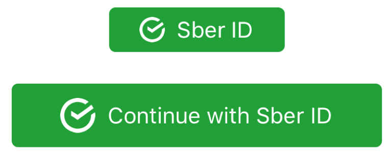 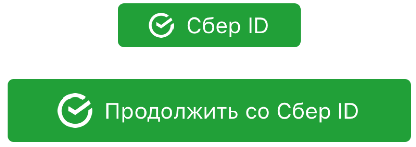

*в примере кнопки с текстом "Сбер ID" и “Sber ID” отрисована с минимально допустимой шириной.

### Степень скругления кнопки (по умолчанию .normal)


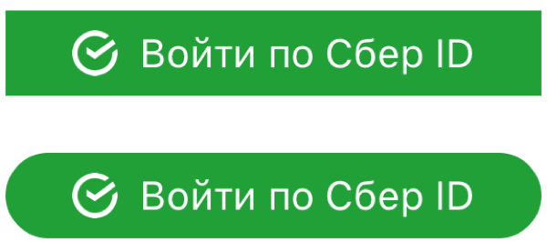

Установить степень скругления кнопки можно с помощью метода кнопки ```setCornerRadius(_ radiusStyle: CornerRadiusStyle)```. При необходимости можно установить свои параметры через стандартный метод ```UIButton``` - ```SBKLoginButton().layer.cornerRadius```.

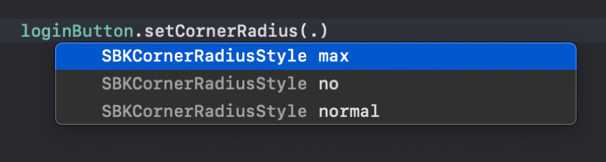

### Обводка


В случае установки типа кнопки "white" есть возможность указать значение цвета обводки. Для этого установите конкретный цвет через метод кнопки ```setBorderColor(_ color: UIColor)```.

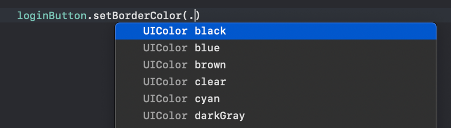

###  Управление статусом загрузки

Начиная с версии SDK 1.3.5 появилась возможность вручную программно управлять статусом загрузки в кнопке (анимированное лого СберБанка, как в разделе Персонализация кнопки).

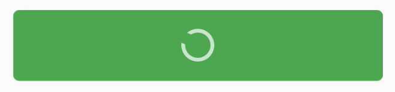 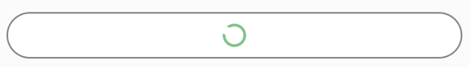

Это может быть полезно, если перед тем, как дать возможность пользователю нажать на кнопку, вам необходимо, например, сделать запрос на сервер и получить oidc-параметры для авторизации по Сбер ID. Либо уже после запуска авторизации дождаться результата ее выполнения.

Установка/снятие статуса загрузки вручную не мешает работе процедуры персонализации кнопки, эти процессы не связаны друг с другом. Если на момент снятия вами статуса загрузки процедура персонализации еще не будет завершена, то анимация лого продолжится до ее завершения.

За управление статусом загрузки отвечает свойство ```isLoaderHidden``` объекта кнопки Sber ID ```SBKLoginButton```

## Персонализация кнопки <a name="Персонализация"></a>

###### ❗️Для приложений Сбера❗️

Начиная с версии SDK 1.2.0 кнопка входа по Сбер ID автоматически поддерживает персонализацию. Персонализация заключается в анимированном изменении текста кнопки на текст содержащий информацию об имени и фамилии пользователя. Процесс изменения происходит автоматически. Все заданные параметры кнопки, остаются без изменений.

Условия для работы функционала персонализации кнопки:
- на устройстве установлено МП СБОЛ версии от 11.9 и выше
- в МП СБОЛ включен функционал персонализации

Если условия персонализации не выполнены, текст на кнопке останется без изменений с сохранением ваших настроек.

Если кнопка была добавлена с коротким текстом "Сбер ID", персонализация кнопки не будет запущена, так как персонализация предполагает наличие широкой кнопки входа, используйте один из длинных вариантов текста.

При запуске процедуры персонализации на кнопке отображается индикатор загрузки:

 

При персонализации кнопка выглядит следующим образом:

 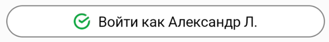

Если имя пользователя слишком длинное, чтобы уместиться в кнопке, итоговый текст будет обрезан с правой стороны.


Для включения возможности персонализации кнопки:
- ваше приложение должно публиковаться в AppStore от группы разработчика "Сбербанк России"
- в настройках проекта должен быть включён функционал Keychain Sharing. *targets → <название основного таргета> → Signing&Capabilities*

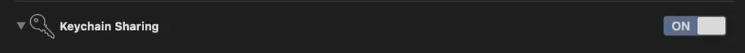

- в настройках *Keychain Sharing* необходимо добавить *keychain group* c именем ```$(AppIdentifierPrefix)ru.sberbank.onlineiphone.shared```, должен появиться файл с расширением ```.entitlements```(если такового не было), в котором, среди прочих, будет данный блок:

```xml
	<key>keychain-access-groups</key>
	<array>
		<string>$(AppIdentifierPrefix)ru.sberbank.onlineiphone.shared</string>
	</array>
```

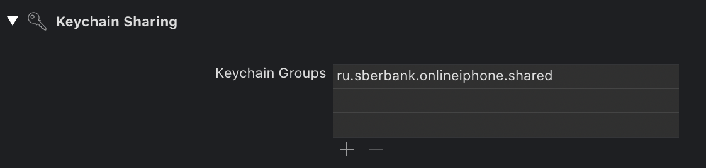

- в *info.plist* проекта необходимо добавить пару ключ-параметр, в RunTime он будет заменен на ```TeamId```.

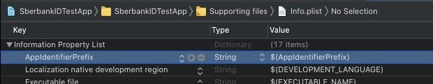

```xml
	<key>AppIdentifierPrefix</key>
	<string>$(AppIdentifierPrefix)</string>
```
